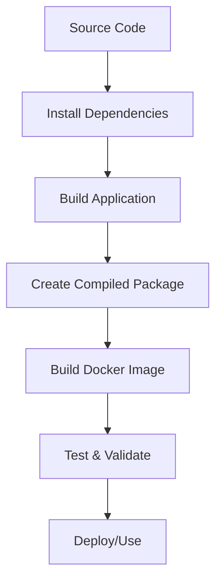

# 🐳 n8n Docker Packaging Guide

*Hướng dẫn tổng hợp tạo và đóng gói Docker image cho n8n từ source code*

## 📋 Tổng quan

Document này hướng dẫn chi tiết cách build và đóng gói n8n thành Docker image từ source code, bao gồm troubleshooting và best practices dựa trên kinh nghiệm thực tế.

### 🎯 Mục tiêu
- Tạo Docker image từ n8n source code
- Hiểu quy trình build và packaging
- Troubleshooting các vấn đề thường gặp
- Setup development và production environments

### 📦 Kết quả cuối cùng
- Docker image: `n8nio/n8n:local`
- Kích thước: ~996MB
- Platform: linux/arm64 (có thể build cho amd64)
- Tính năng đầy đủ với task runners

---

## 🏗️ Kiến trúc Build Process

### 📊 Build Pipeline Overview



### 🔧 Build Components

1. **Application Build** (`build-n8n.mjs`)
   - Compile TypeScript code
   - Bundle frontend assets
   - Create production deployment package

2. **Docker Build** (`dockerize-n8n.mjs`)
   - Multi-stage Docker build
   - Download task runner launcher
   - Configure runtime environment

3. **Base Images**
   - `n8nio/base:22` - Node.js runtime base
   - `alpine:3.22.0` - Lightweight Linux base

---

## 🚀 Quy trình Build chi tiết

### 1️⃣ **Chuẩn bị Environment**

#### Yêu cầu hệ thống
```bash
# Kiểm tra Node.js version
node --version  # >= 22.16

# Kiểm tra pnpm
pnpm --version  # >= 10.2.1

# Kiểm tra Docker
docker --version  # >= 20.10
```

#### Clone và Setup
```bash
# Clone repository
git clone https://github.com/n8n-io/n8n.git
cd n8n

# Kiểm tra cấu trúc
ls -la
# packages/  scripts/  docker/  docs/  ...
```

### 2️⃣ **Install Dependencies**

#### Xử lý Lockfile Issues
```bash
# Nếu gặp lỗi lockfile outdated
pnpm install --no-frozen-lockfile

# Hoặc update lockfile
pnpm install
```

#### Verify Installation
```bash
# Kiểm tra packages đã install
ls packages/
# cli/  core/  frontend/  nodes-base/  ...

# Kiểm tra build scripts
cat package.json | grep "build"
```

### 3️⃣ **Build Application**

#### Option 1: Sử dụng Built-in Scripts
```bash
# Build toàn bộ ứng dụng
pnpm run build:n8n

# Hoặc build từng phần
pnpm run build:backend
pnpm run build:frontend
```

#### Option 2: Manual Build Process
```bash
# Build individual packages
pnpm run build --filter=n8n-core
pnpm run build --filter=n8n-cli
pnpm run build --filter=n8n-editor-ui
```

#### Verify Build Output
```bash
# Kiểm tra compiled directory
ls -la compiled/
# node_modules/  package.json  bin/  dist/  ...

# Kiểm tra size
du -sh compiled/
# ~921MB
```

### 4️⃣ **Build Docker Image**

#### Method 1: Sử dụng Build Script (Recommended)
```bash
# Build cả application và Docker image
pnpm run build:docker
```

#### Method 2: Manual Docker Build
```bash
# Build với platform specific
docker build \
  --platform linux/arm64 \
  --build-arg TARGETPLATFORM=linux/arm64 \
  --build-arg N8N_VERSION=local \
  -t n8nio/n8n:local \
  -f docker/images/n8n/Dockerfile \
  .
```

#### Method 3: Cross-platform Build
```bash
# Build cho multiple platforms
docker buildx build \
  --platform linux/amd64,linux/arm64 \
  --build-arg TARGETPLATFORM=linux/amd64 \
  -t n8nio/n8n:local \
  -f docker/images/n8n/Dockerfile \
  .
```

### 5️⃣ **Verify Docker Image**

#### Kiểm tra Image
```bash
# List images
docker images n8nio/n8n:local

# Inspect image
docker inspect n8nio/n8n:local
```

#### Test Run
```bash
# Quick test
docker run --rm -p 5678:5678 \
  -e N8N_BASIC_AUTH_ACTIVE=true \
  -e N8N_BASIC_AUTH_USER=admin \
  -e N8N_BASIC_AUTH_PASSWORD=admin123 \
  n8nio/n8n:local
```

---

## 🔧 Dockerfile Analysis

### 📁 Multi-stage Build Structure

```dockerfile
# Stage 1: System Dependencies
FROM n8nio/base:22 AS system-deps

# Stage 2: Application Artifact Processor  
FROM alpine:3.22.0 AS app-artifact-processor
COPY ./compiled /app/

# Stage 3: Task Runner Launcher
FROM alpine:3.22.0 AS launcher-downloader
# Download task runner binaries

# Stage 4: Final Runtime Image
FROM system-deps AS runtime
# Combine all components
```

### 🔍 Key Components

#### Base Image (`n8nio/base:22`)
- Node.js 22 runtime
- System dependencies
- Security patches
- Performance optimizations

#### Application Layer
```dockerfile
COPY --from=app-artifact-processor /app /usr/local/lib/node_modules/n8n
RUN cd /usr/local/lib/node_modules/n8n && \
    npm rebuild sqlite3 && \
    ln -s /usr/local/lib/node_modules/n8n/bin/n8n /usr/local/bin/n8n
```

#### Task Runner Integration
```dockerfile
COPY --from=launcher-downloader /launcher-bin/* /usr/local/bin/
COPY docker/images/n8n/n8n-task-runners.json /etc/n8n-task-runners.json
```

#### Runtime Configuration
```dockerfile
ENV NODE_ENV=production
ENV N8N_RELEASE_TYPE=dev
ENV NODE_ICU_DATA=/usr/local/lib/node_modules/full-icu
EXPOSE 5678/tcp
USER node
ENTRYPOINT ["tini", "--", "/docker-entrypoint.sh"]
```

---

## 🚨 Troubleshooting Common Issues

### 1️⃣ **Lockfile Issues**

#### Problem
```
ERR_PNPM_OUTDATED_LOCKFILE Cannot install with "frozen-lockfile"
```

#### Solution
```bash
# Option 1: Update lockfile
pnpm install --no-frozen-lockfile

# Option 2: Force update
rm pnpm-lock.yaml
pnpm install
```

### 2️⃣ **Platform Architecture Issues**

#### Problem
```
Unsupported platform: 
ERROR: executor failed running [...]: exit code: 1
```

#### Solution
```bash
# Specify platform explicitly
docker build \
  --platform linux/arm64 \
  --build-arg TARGETPLATFORM=linux/arm64 \
  -t n8nio/n8n:local \
  -f docker/images/n8n/Dockerfile .
```

### 3️⃣ **Build Context Too Large**

#### Problem
```
transferring context: 692.51MB
```

#### Solution
```bash
# Optimize .dockerignore
echo "node_modules
.git
.turbo
cypress/videos
cypress/screenshots
*.log" >> .dockerignore

# Clean build artifacts
pnpm clean
rm -rf node_modules/.cache
```

### 4️⃣ **Memory Issues During Build**

#### Problem
```
JavaScript heap out of memory
```

#### Solution
```bash
# Increase Node.js memory
export NODE_OPTIONS="--max-old-space-size=8192"

# Or use build script with memory options
NODE_OPTIONS="--max-old-space-size=8192" pnpm run build:docker
```

### 5️⃣ **Task Runner Download Issues**

#### Problem
```
wget: can't connect to github.com
```

#### Solution
```bash
# Check network connectivity
curl -I https://github.com

# Use proxy if needed
docker build --build-arg HTTP_PROXY=http://proxy:8080 ...

# Or download manually and COPY
```

---

## 🛠️ Development Workflow

### 🔄 Iterative Development

#### 1. Code Changes
```bash
# Make changes to source code
vim packages/cli/src/...

# Quick build test
pnpm run build --filter=n8n-cli
```

#### 2. Incremental Build
```bash
# Build only changed components
pnpm run build:backend  # if backend changes
pnpm run build:frontend # if frontend changes
```

#### 3. Docker Rebuild
```bash
# Rebuild Docker image
docker build -t n8nio/n8n:dev-$(date +%s) \
  -f docker/images/n8n/Dockerfile .
```

#### 4. Test Changes
```bash
# Test with new image
docker run --rm -p 5678:5678 n8nio/n8n:dev-$(date +%s)
```

### 🧪 Testing Strategy

#### Unit Tests
```bash
# Run all tests
pnpm test

# Run specific package tests
pnpm test --filter=n8n-cli
pnpm test --filter=n8n-core
```

#### Integration Tests
```bash
# E2E tests
cd cypress
pnpm run test:e2e

# Docker integration test
docker run --rm n8nio/n8n:local n8n --version
```

#### Performance Tests
```bash
# Memory usage test
docker stats n8n-container

# Startup time test
time docker run --rm n8nio/n8n:local n8n --help
```

---

## 📦 Production Deployment

### 🚀 Docker Compose Setup

#### Basic Configuration
```yaml
version: '3.8'
services:
  n8n:
    image: n8nio/n8n:local
    container_name: n8n
    ports:
      - "5678:5678"
    environment:
      - N8N_BASIC_AUTH_ACTIVE=true
      - N8N_BASIC_AUTH_USER=admin
      - N8N_BASIC_AUTH_PASSWORD=admin123
      - N8N_RUNNERS_ENABLED=true
      - GENERIC_TIMEZONE=Asia/Ho_Chi_Minh
    volumes:
      - n8n_data:/home/node/.n8n
    restart: unless-stopped

volumes:
  n8n_data:
```

#### Advanced Configuration
```yaml
version: '3.8'
services:
  n8n:
    image: n8nio/n8n:local
    container_name: n8n
    ports:
      - "5678:5678"
    environment:
      # Database
      - DB_TYPE=postgresdb
      - DB_POSTGRESDB_HOST=postgres
      - DB_POSTGRESDB_DATABASE=n8n
      - DB_POSTGRESDB_USER=n8n
      - DB_POSTGRESDB_PASSWORD=n8n_password
      
      # Redis (for queue mode)
      - QUEUE_BULL_REDIS_HOST=redis
      - EXECUTIONS_MODE=queue
      
      # Security
      - N8N_BASIC_AUTH_ACTIVE=true
      - N8N_BASIC_AUTH_USER=admin
      - N8N_BASIC_AUTH_PASSWORD=${N8N_PASSWORD}
      
      # Performance
      - N8N_RUNNERS_ENABLED=true
      - N8N_RUNNERS_MAX_CONCURRENCY=5
      
    volumes:
      - n8n_data:/home/node/.n8n
    depends_on:
      - postgres
      - redis
    restart: unless-stopped

  postgres:
    image: postgres:15
    environment:
      - POSTGRES_DB=n8n
      - POSTGRES_USER=n8n
      - POSTGRES_PASSWORD=n8n_password
    volumes:
      - postgres_data:/var/lib/postgresql/data
    restart: unless-stopped

  redis:
    image: redis:7-alpine
    restart: unless-stopped

volumes:
  n8n_data:
  postgres_data:
```

### 🔒 Security Considerations

#### Environment Variables
```bash
# Use .env file for secrets
cat > .env << EOF
N8N_PASSWORD=your_secure_password
DB_PASSWORD=your_db_password
JWT_SECRET=your_jwt_secret
EOF

# Reference in docker-compose.yml
environment:
  - N8N_BASIC_AUTH_PASSWORD=${N8N_PASSWORD}
```

#### Network Security
```yaml
# Restrict network access
networks:
  n8n_network:
    driver: bridge
    ipam:
      config:
        - subnet: 172.20.0.0/16

services:
  n8n:
    networks:
      - n8n_network
    # Don't expose to all interfaces in production
    ports:
      - "127.0.0.1:5678:5678"
```

#### File Permissions
```bash
# Ensure proper file permissions
docker exec n8n-container chown -R node:node /home/node/.n8n
docker exec n8n-container chmod 600 /home/node/.n8n/config
```

---

## 📊 Performance Optimization

### 🚀 Build Performance

#### Parallel Builds
```bash
# Use turbo for parallel builds
pnpm run build --parallel

# Limit concurrency if memory constrained
pnpm run build --concurrency=2
```

#### Build Caching
```bash
# Use Docker buildkit cache
export DOCKER_BUILDKIT=1

# Cache mount for node_modules
docker build --mount=type=cache,target=/root/.pnpm-store ...
```

#### Multi-stage Optimization
```dockerfile
# Optimize layer caching
COPY package.json pnpm-lock.yaml ./
RUN pnpm install --frozen-lockfile

# Copy source code after dependencies
COPY . .
RUN pnpm build
```

### 🏃‍♂️ Runtime Performance

#### Resource Limits
```yaml
services:
  n8n:
    deploy:
      resources:
        limits:
          memory: 2G
          cpus: '1.0'
        reservations:
          memory: 1G
          cpus: '0.5'
```

#### Task Runner Configuration
```json
{
  "taskRunners": {
    "javascript": {
      "maxConcurrency": 5,
      "memoryLimit": "512MB"
    }
  }
}
```

---

## 🔍 Monitoring & Logging

### 📈 Health Checks

#### Docker Health Check
```dockerfile
HEALTHCHECK --interval=30s --timeout=10s --start-period=60s --retries=3 \
  CMD curl -f http://localhost:5678/healthz || exit 1
```

#### Compose Health Check
```yaml
services:
  n8n:
    healthcheck:
      test: ["CMD", "curl", "-f", "http://localhost:5678/healthz"]
      interval: 30s
      timeout: 10s
      retries: 3
      start_period: 60s
```

### 📝 Logging Configuration

#### Structured Logging
```yaml
environment:
  - N8N_LOG_LEVEL=info
  - N8N_LOG_OUTPUT=console
  - N8N_LOG_FILE_COUNT_MAX=3
  - N8N_LOG_FILE_SIZE_MAX=16777216
```

#### Log Aggregation
```yaml
logging:
  driver: "json-file"
  options:
    max-size: "10m"
    max-file: "3"
    labels: "service=n8n,environment=production"
```

---

## 🎯 Best Practices

### 🏗️ Build Best Practices

#### 1. **Consistent Environment**
```bash
# Use exact versions
"engines": {
  "node": "22.16.0",
  "pnpm": "10.12.1"
}

# Lock dependencies
pnpm install --frozen-lockfile
```

#### 2. **Optimized Docker Images**
```dockerfile
# Multi-stage builds
FROM node:22-alpine AS builder
# ... build steps

FROM node:22-alpine AS runtime
COPY --from=builder /app/dist ./dist
```

#### 3. **Security Hardening**
```dockerfile
# Use non-root user
USER node

# Minimal attack surface
FROM alpine:3.22.0
RUN apk add --no-cache nodejs npm
```

### 🚀 Deployment Best Practices

#### 1. **Environment Separation**
```bash
# Different configs for different environments
docker-compose.dev.yml
docker-compose.staging.yml
docker-compose.prod.yml
```

#### 2. **Secret Management**
```bash
# Use Docker secrets
echo "admin_password" | docker secret create n8n_password -

# Reference in compose
secrets:
  - n8n_password
```

#### 3. **Backup Strategy**
```bash
# Regular data backups
docker run --rm -v n8n_data:/data -v $(pwd):/backup \
  alpine tar czf /backup/n8n-backup-$(date +%Y%m%d).tar.gz /data
```

### 🔧 Maintenance Best Practices

#### 1. **Regular Updates**
```bash
# Update base images
docker pull n8nio/base:22

# Rebuild with updates
docker build --no-cache -t n8nio/n8n:latest .
```

#### 2. **Monitoring**
```bash
# Resource monitoring
docker stats n8n-container

# Log monitoring
docker logs -f n8n-container | grep ERROR
```

#### 3. **Cleanup**
```bash
# Clean unused images
docker image prune -f

# Clean build cache
docker builder prune -f
```

---

## 📚 Advanced Topics

### 🔧 Custom Builds

#### Development Build
```bash
# Build with development features
docker build \
  --build-arg N8N_RELEASE_TYPE=dev \
  --build-arg NODE_ENV=development \
  -t n8nio/n8n:dev .
```

#### Debug Build
```bash
# Build with debug symbols
docker build \
  --build-arg NODE_OPTIONS="--inspect=0.0.0.0:9229" \
  -t n8nio/n8n:debug .
```

### 🌐 Multi-Architecture Builds

#### Setup Buildx
```bash
# Create builder instance
docker buildx create --name n8n-builder --use

# Build for multiple platforms
docker buildx build \
  --platform linux/amd64,linux/arm64 \
  --push \
  -t your-registry/n8n:latest .
```

### 🏭 CI/CD Integration

#### GitHub Actions
```yaml
name: Build n8n Docker Image
on:
  push:
    branches: [main]

jobs:
  build:
    runs-on: ubuntu-latest
    steps:
      - uses: actions/checkout@v3
      
      - name: Setup Node.js
        uses: actions/setup-node@v3
        with:
          node-version: '22'
          
      - name: Install pnpm
        run: npm install -g pnpm
        
      - name: Build application
        run: pnpm run build:n8n
        
      - name: Build Docker image
        run: |
          docker build \
            --build-arg TARGETPLATFORM=linux/amd64 \
            -t n8nio/n8n:${{ github.sha }} .
            
      - name: Test image
        run: |
          docker run --rm -d --name test-n8n n8nio/n8n:${{ github.sha }}
          sleep 30
          docker logs test-n8n
          docker stop test-n8n
```

---

## 📖 Quick Reference

### 🚀 Essential Commands

```bash
# Full build process
pnpm install --no-frozen-lockfile
pnpm run build:n8n
docker build --platform linux/arm64 \
  --build-arg TARGETPLATFORM=linux/arm64 \
  -t n8nio/n8n:local \
  -f docker/images/n8n/Dockerfile .

# Quick test
docker run --rm -p 5678:5678 \
  -e N8N_BASIC_AUTH_ACTIVE=true \
  -e N8N_BASIC_AUTH_USER=admin \
  -e N8N_BASIC_AUTH_PASSWORD=admin123 \
  n8nio/n8n:local

# Production deployment
docker-compose up -d
```

### 🔧 Troubleshooting Checklist

- [ ] Node.js version >= 22.16
- [ ] pnpm version >= 10.2.1
- [ ] Docker version >= 20.10
- [ ] Sufficient disk space (>5GB)
- [ ] Sufficient memory (>8GB)
- [ ] Network connectivity for downloads
- [ ] Correct platform architecture
- [ ] Updated dependencies

### 📁 File Structure

```
n8n-project/
├── docker-compose.yml           # Production deployment
├── .env                        # Environment variables
├── docker/
│   └── images/n8n/
│       ├── Dockerfile          # Main Docker build file
│       ├── docker-entrypoint.sh
│       └── n8n-task-runners.json
├── compiled/                   # Build output (~921MB)
└── docs/
    └── n8n-docker-packaging-guide.md
```

---

## 🎉 Conclusion

Document này cung cấp hướng dẫn toàn diện để build và deploy n8n Docker image từ source code. Với các best practices và troubleshooting tips, bạn có thể tự tin tạo và maintain n8n deployment của riêng mình.

### 🔗 Related Resources

- **[n8n Development Guide](./n8n-development-guide.md)** - Phát triển n8n core
- **[Custom Node Development](./n8n-custom-node-development.md)** - Tạo custom nodes
- **[Git Workflow Guide](./n8n-git-workflow-guide.md)** - Git best practices

### 📞 Support

Nếu gặp vấn đề, hãy tham khảo:
- [n8n Community Forum](https://community.n8n.io/)
- [GitHub Issues](https://github.com/n8n-io/n8n/issues)
- [Official Documentation](https://docs.n8n.io/)

---

*Happy containerizing! 🐳✨* 